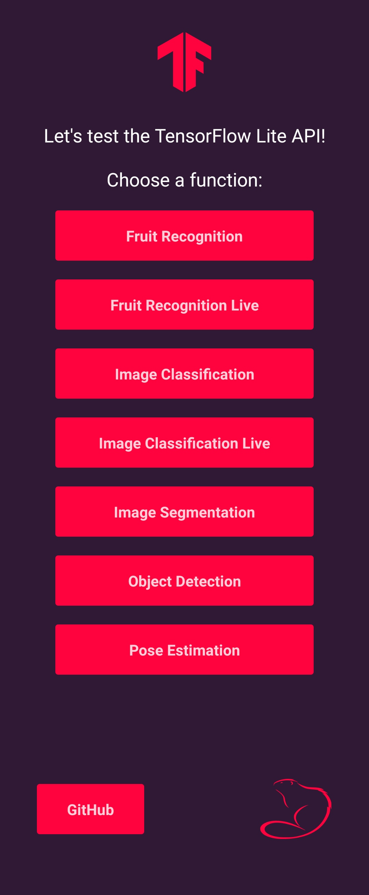
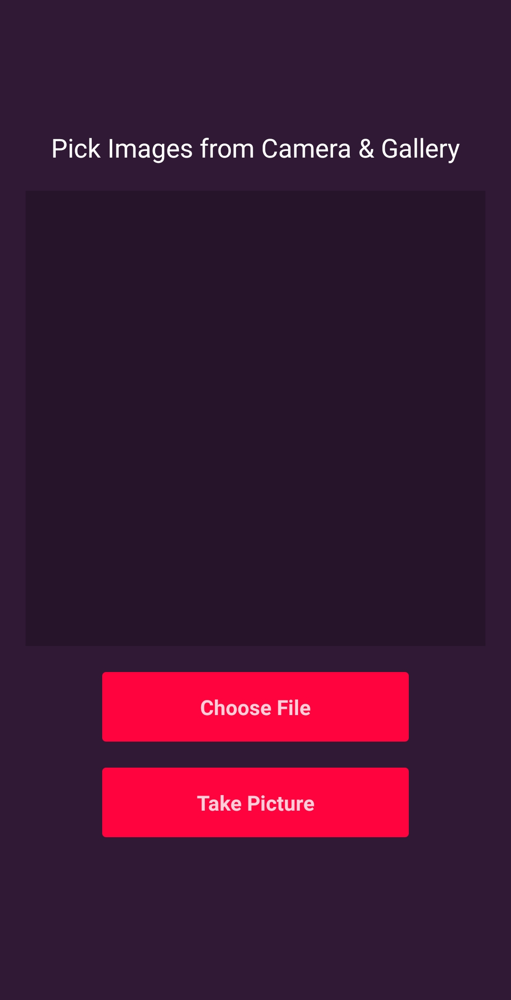
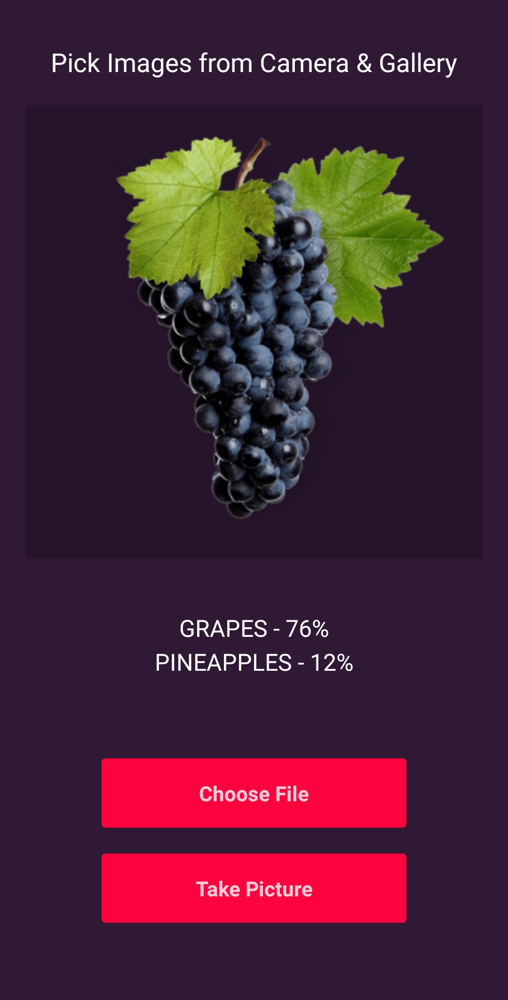
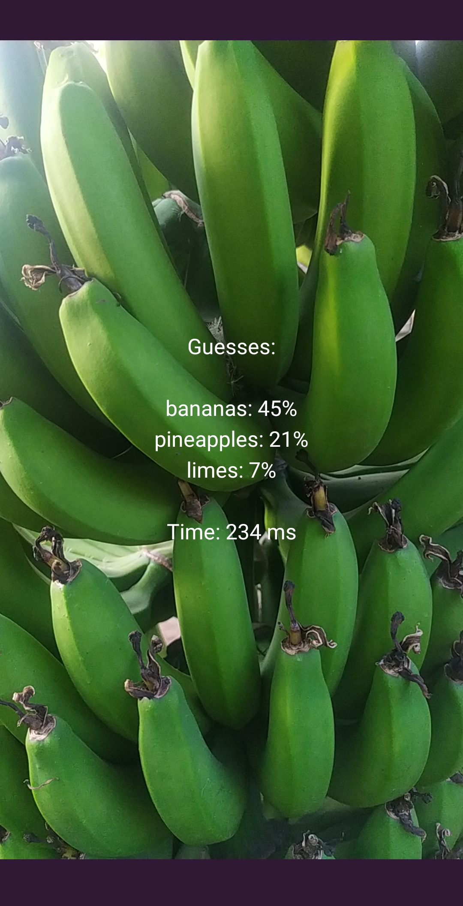
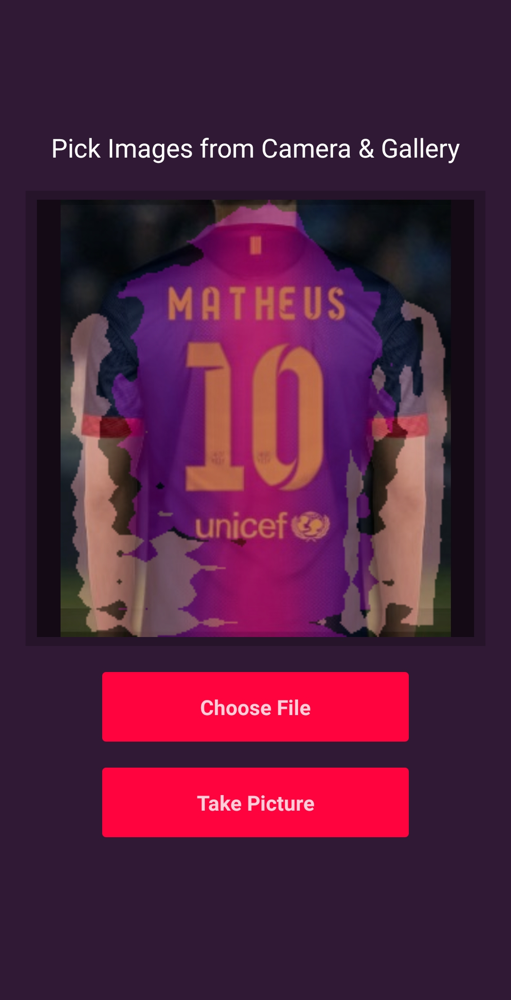
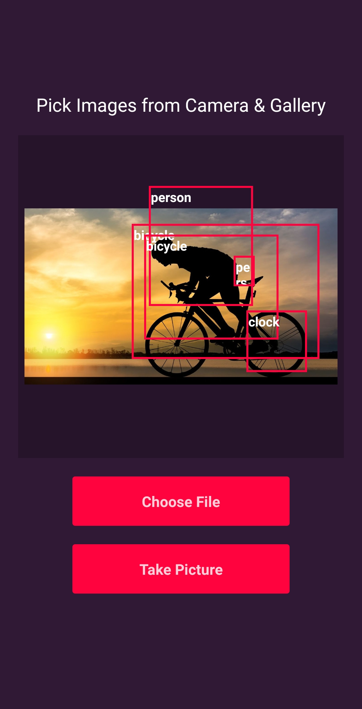
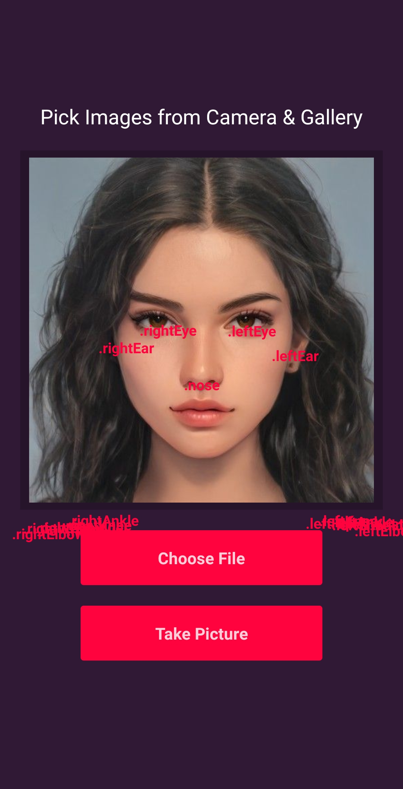

## Machine Learning use in React Native The Practical Guide

> 👷 Developed by Matheus Ramalho de Oliveira  
🔨 Brazilian Software Engineer  
🏡 Goiânia, Goiás, Brasil  
✉️ kastorcode@gmail.com  
👍 [instagram.com/kastorcode](https://www.instagram.com/kastorcode)

---

  

  How to use machine learning in React Native applications? This app is about answering this question through models from the TensorFlow Lite library.

  Architected and programmed during the Machine Learning use in React Native The Practical Guide course.

---

### Screenshots

  

  

  

  

  

  

  

---

### Tools used

[Git](https://git-scm.com)  
[Google Colab](https://colab.research.google.com)  
[Kaggle](https://kaggle.com)  
[React Native](https://reactnative.dev)  
[Teachable Machine](https://teachablemachine.withgoogle.com)  
[TensorFlow Lite](https://tensorflow.org/lite)  
[TypeScript](https://typescriptlang.org)  
[Visual Studio Code](https://code.visualstudio.com)

---

### Topics covered

1. Creating a new React Native project;
2. Creating GUI of the application;
3. Choosing images from gallery;
4. Capturing images using camera;
5. Adding TensorFlow Lite models inside React Native project;
6. Performing image classification;
7. Performing image classification with live camera footage;
8. Performing object detection;
9. Performing pose estimation;
10. Performing image segmentation;
11. Showing predictions on screen;
12. Training image classification model;
13. Dog breed recognition with images;
14. Training fruit recognition model with transfer learning;
15. Retraining other models;
16. Fruit recognition using live camera footage.

---

### 🧠 Installation and execution

1. Make a clone of this repository;
2. Open the project folder in a terminal;
3. Run `yarn` to install dependencies;
4. Run the commands `yarn start` and `yarn android` to start Metro server and compile the app;
5. Start coding!

---

  

